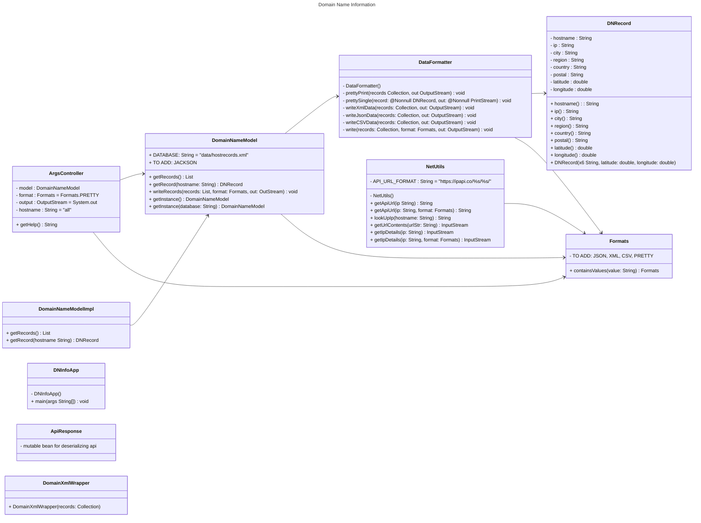
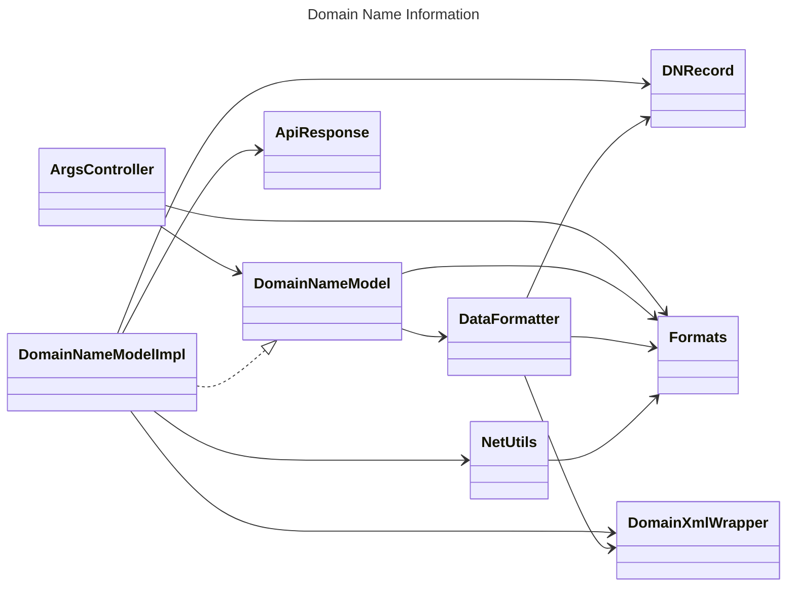

# Domain Name Information Design Document

This document is meant to provide a tool for you to demonstrate the design process. You need to work on this before you code, and after have a finished product. That way you can compare the changes, and changes in design are normal as you work through a project. It is contrary to popular belief, but we are not perfect our first attempt. We need to iterate on our designs to make them better. This document is a tool to help you do that.

If you are using mermaid markup to generate your class diagrams, you may edit this document in the sections below to insert your markup to generate each diagram. Otherwise, you may simply include the images for each diagram requested below in your zipped submission (be sure to name each diagram image clearly in this case!)

## (INITIAL DESIGN): Class Diagram

Include a UML class diagram of your initial design for this assignment. If you are using the mermaid markdown, you may include the code for it here. For a reminder on the mermaid syntax, you may go [here](https://mermaid.js.org/syntax/classDiagram.html)

## (INITIAL DESIGN): Tests to Write - Brainstorm

Write a test (in english) that you can picture for the class diagram you have created. This is the brainstorming stage in the TDD process. 

> [!TIP]
> As a reminder, this is the TDD process we are following:
> 1. Figure out a number of tests by brainstorming (this step)
> 2. Write **one** test
> 3. Write **just enough** code to make that test pass
> 4. Refactor/update  as you go along
> 5. Repeat steps 2-4 until you have all the tests passing/fully built program

You should feel free to number your brainstorm. 
1. Test `DataFormatter`
    * `prettyPrint()` returns expected output
    * `writeXmlData()` returns the correct values, tags, structure
    * `writeJsonData()` returns correct format
    * `writeCSVData()` returns correct format with headers and values
    * write()
2. Test `ArgsController`
   * test default values are returned correctly
     * `getFormat()` returns Format.PRETTY
     * `getOutput()` returns System.out
     * `getHostname()` returns "all"
   * `getFormat()` returns correct format
     * JSON
     * XML
     * CSV
     * PRETTY
   * `getHostname()` returns correct host name
   * `getOutput()` returns the correct object type
   * `getDatabase()` returns correct string
   * `getHelp()` returns true for string
   * `isHelpRequest()` returns true or false 
3. Test `DomainNameModelImpl`
   * `getRecords()` returns correct hostname & ip
   * `getRecords()` returns correct for all three
   * `getInstance()` in DomainNameModel returns DomainNameModelImpl object
   * verify the returned list can't be modified
   * `getRecord()` returns correct record for existing hostname

## (FINAL DESIGN): Class Diagram

Go through your completed code, and update your class diagram to reflect the final design. We want both the diagram for your initial and final design, so you may include another image or include the finalized mermaid markup below. It is normal that the two diagrams don't match! Rarely (though possible) is your initial design perfect. 

> [!WARNING]
> If you resubmit your assignment for manual grading, this is a section that often needs updating. You should double check with every resubmit to make sure it is up to date.

## (FINAL DESIGN): Reflection/Retrospective

> [!IMPORTANT]
> The value of reflective writing has been highly researched and documented within computer science, from learning new information to showing higher salaries in the workplace. For this next part, we encourage you to take time, and truly focus on your retrospective.

Take time to reflect on how your design has changed. Write in *prose* (i.e. do not bullet point your answers - it matters in how our brain processes the information). Make sure to include what were some major changes, and why you made them. What did you learn from this process? What would you do differently next time? What was the most challenging part of this process? For most students, it will be a paragraph or two. 

The major changes I made where adding the following classes: `DomainNameModelImpl` to implement the interface and `ApiResponse` a mutable bean to hold data coming from ipapi.co.

The challenge I faced was understanding that `DNRecord` was a nested record, not its own class/file, and that it was accessed through `DomainNameModel.DNRecord`. Another challenge I came across was testing `DataFromatter`. Because I only knew the structure for 'Pretty Print', I had to create write experiment methods so that I could see what the structure looked like for CSV, JSON, and XML. 

test